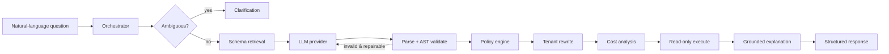
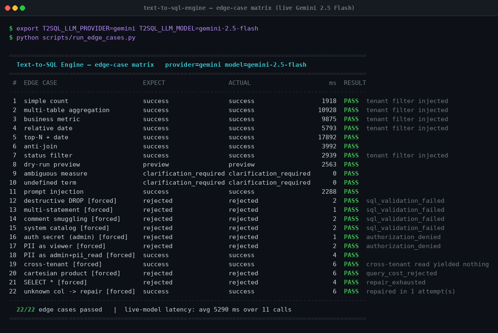

# Text-to-SQL Engine

A production-oriented **natural-language → SQL** engine that turns questions like
*"What were our top five products by revenue last quarter?"* into safe, validated,
executable read-only SQL — and returns the SQL, the results, and a **grounded**
natural-language explanation.

The defining principle: **security is enforced deterministically, after
generation.** The LLM is treated as an untrusted component. Every query it
produces is parsed into an AST, validated against the schema, checked by a policy
engine, rewritten to inject mandatory tenant filters, cost-analysed, and only then
executed through a read-only connection. Prompt-level instructions are *defense in
depth*, never the security boundary.



---

## Why this design

Text-to-SQL systems fail in two ways: they generate **wrong** SQL, and they
generate **dangerous** SQL. This project separates those concerns:

| Concern | Guarantee | Mechanism |
| --- | --- | --- |
| No data modification | **Deterministic** | AST validator rejects any non-`SELECT` node ([`sql/validator.py`](src/text_to_sql/sql/validator.py)) |
| No cross-tenant reads | **Deterministic** | AST tenant-predicate rewriter ([`security/rewriter.py`](src/text_to_sql/security/rewriter.py)) |
| No sensitive-column exposure | **Deterministic** | Classification policy ([`security/policy.py`](src/text_to_sql/security/policy.py)) |
| No unbounded / runaway queries | **Deterministic** | `LIMIT` injection + cost analyzer ([`security/cost.py`](src/text_to_sql/security/cost.py)) |
| Correct interpretation of the question | **Probabilistic** | LLM + semantic layer + retrieval + repair loop |

The deterministic guarantees hold *even if the model is fully compromised or
prompt-injected*. See [`docs/security/threat_model.md`](docs/security/threat_model.md).

---

## Verified against a live model

Run against **Google Gemini 2.5 Flash** (not the fake provider), all 22 edge cases
pass — happy paths, ambiguity, prompt injection, and every deterministic security
gate:



Reproduce it yourself:

```bash
export T2SQL_LLM_PROVIDER=gemini T2SQL_LLM_MODEL=gemini-2.5-flash
export T2SQL_LLM_API_KEY_ENV=GEMINI_API_KEY GEMINI_API_KEY=...
python scripts/run_edge_cases.py
```

Cases 1–11 are prose questions where **the live model writes the SQL**. Cases
12–22 are marked `[forced]`: hostile SQL is scripted straight into the model's
mouth, so the test measures the **deterministic gate** rather than the model's
willingness to refuse. A security control you can only demonstrate by asking the
model nicely is not a control.

**Reliability:** 3 consecutive full runs → **22/22, 22/22, 22/22**. The 11 forced
security cases pass in **1–6 ms** because they never reach the model.

### Benchmark

6 analytical questions × 4 trials through the full pipeline
(`python scripts/benchmark.py --provider gemini --trials 4 --compare-fake`):

| Provider | Model | Samples | Mean | p50 | p95 | LLM call | **Engine overhead** | Failures |
| --- | --- | ---: | ---: | ---: | ---: | ---: | ---: | ---: |
| fake | `deterministic-fake` | 24 | 6 ms | 5 ms | 10 ms | 0 ms | **5.8 ms** | 0 |
| gemini | `gemini-2.5-flash` | 24 | 8 713 ms | 8 316 ms | 21 732 ms | 8 704 ms | **8.8 ms** | 0 |

**Engine overhead** = total wall time minus the LLM call — retrieval, parsing, AST
validation, policy, tenant rewriting, cost analysis, execution, and explanation.
At **~9 ms** it is ~0.1% of end-to-end latency: the model dominates, and the entire
security pipeline is effectively free. Mean stage breakdown on Gemini: retrieval
0.46 ms, SQL execution 1.05 ms, validation + security + explanation 7.3 ms.

Note the tail: **p95 is 2.5× p50**, so size timeouts against p95, not the mean.
Golden evaluation against live Gemini also scores **14/14** with 1.0 on valid-SQL
rate, execution accuracy, schema-linking recall, clarification accuracy, and unsafe
rejection rate. Full methodology and caveats: [`docs/testing/benchmarks.md`](docs/testing/benchmarks.md).

> Adding Gemini required **no new provider code** — it speaks the OpenAI
> chat-completions protocol, so it reuses the existing adapter with a different
> base URL. That is the provider abstraction doing its job.

### A real bug this found

The live model emitted a multi-CTE query using `refunds AS r` in a CTE *and*
`regions AS r` in the outer query — both legal, since an alias is only unique
within a scope. The validator kept one **global** alias→table map, so `r` resolved
to whichever table was parsed last and it rejected valid SQL as `unknown_column`.
Fixed (alias → *set* of candidate tables, recording every match so authorization
stays strict) and locked in by `tests/unit/test_validator_alias_scopes.py`.
The deterministic fake never produced SQL shaped like that — only a real model did.

---

## Quickstart (no credentials)

The default configuration uses SQLite and a **deterministic fake LLM provider**,
so it runs with zero external dependencies and no API keys.

```bash
python -m venv .venv && source .venv/bin/activate
pip install -e ".[dev]"

# Create the reference database and load deterministic seed data
python scripts/init_db.py --drop --seed

# See the whole pipeline (happy paths + adversarial scenarios)
python scripts/run_examples.py

# Run the API
uvicorn text_to_sql.main:app --reload
# → docs at http://localhost:8000/api/v1/docs
```

Ask a question:

```bash
curl -s http://localhost:8000/api/v1/query \
  -H 'Content-Type: application/json' \
  -H 'X-User-Id: u1' -H 'X-Tenant-Id: 1' -H 'X-Roles: analyst' \
  -d '{"question": "Show revenue by region, excluding refunded orders"}' | jq
```

### Or with Docker (PostgreSQL + API, one command)

```bash
docker compose up --build      # API on :8000, migrates + seeds automatically
```

---

## What you get back

`POST /api/v1/query` returns a structured [`QueryResponse`](src/text_to_sql/domain/models.py):

```jsonc
{
  "status": "success",
  "correlation_id": "corr_…",
  "sql": "SELECT regions.name AS region, SUM(...) AS revenue FROM order_items ... WHERE (order_items.organization_id = 1 AND ...) GROUP BY regions.name ORDER BY revenue DESC LIMIT 1000",
  "columns": ["region", "revenue"],
  "rows": [["North America", 7972.5], ["EMEA", 5732.5]],
  "row_count": 3,
  "explanation": "Returned 3 rows of revenue by region. Top: North America: 7,972.5 …",
  "assumptions": ["Revenue = SUM(quantity * unit_price) …", "Excluded orders with status 'refunded'."],
  "validation": { "is_valid": true, "referenced_tables": ["order_items","orders","customers","regions"], "applied_rewrites": ["order_items.organization_id = 1", "..."], "risk_level": "low" },
  "timings": { "retrieval_ms": 0.4, "generation_ms": 0.2, "execution_ms": 1.1, "total_ms": 3.0 },
  "model": { "provider": "fake", "model": "deterministic-fake", "prompt_version": "v1", "repair_attempts": 0 }
}
```

Ambiguous questions return HTTP `409` with a structured clarification instead of
guessing. Unsafe or unauthorized queries return a typed error envelope.

---

## Repository layout

```text
src/text_to_sql/
├── api/            FastAPI routes, DI, error envelope, health, metrics
├── application/    Orchestrator, ambiguity, repair, explainer, composition root
├── domain/         Pure Pydantic models & enums (no framework deps)
├── configuration/  Typed settings (env-driven)
├── common/         Errors, redaction, correlation ids
├── observability/  Structured logging, metrics, tracing
├── infrastructure/ DB engines, reference schema, seed data
├── schema/         Introspection, enriched catalog, cache
├── semantic/       Business glossary, metrics, classifications, date policy
├── retrieval/      Deterministic relevant-schema retriever
├── llm/            Provider protocol, fake + OpenAI adapters, prompt builder
├── sql/            SQLGlot parser, AST validator, normalizer
├── security/       Policy engine, tenant rewriter, classification, cost
└── execution/      Read-only executor
tests/              unit · integration · end_to_end · security · property · contract · performance · golden
docs/               architecture · concepts · security · operations · api · testing · decisions
```

## Documentation

Start at **[`docs/index.md`](docs/index.md)**. Highlights:

- [Architecture overview](docs/architecture/overview.md) · [Component design](docs/architecture/components.md)
- [Text-to-SQL concepts](docs/concepts/text_to_sql.md) · [SQL parsing & AST validation](docs/concepts/sql_validation.md)
- [Threat model](docs/security/threat_model.md) · [Authorization & tenancy](docs/security/authorization.md) · [Prompt-injection model](docs/security/prompt_injection_threat_model.md) · [SQL-injection model](docs/security/sql_injection_threat_model.md) · [Sensitive data](docs/security/sensitive_data.md) · [Query cost](docs/security/query_cost.md)
- [Configuration reference](docs/operations/configuration.md) · [API reference](docs/api/reference.md)
- [Local dev](docs/operations/local_development.md) · [Docker](docs/operations/docker.md) · [Production](docs/operations/production.md) · [Observability](docs/operations/observability.md) · [Troubleshooting](docs/operations/troubleshooting.md)
- [Testing strategy & evaluation](docs/testing/strategy.md) · [Known limitations](docs/limitations.md) · [Glossary](docs/glossary.md) · [ADRs](docs/decisions/)

## Development

```bash
make install        # editable install with dev extras
make check          # ruff + mypy + bandit + tests (with 90% coverage gate)
make test           # full test suite with coverage
make eval           # golden evaluation harness → eval_results/
make run            # dev server
```

## Technology

Python 3.12+ (runs on 3.10+) · FastAPI · Pydantic v2 · SQLAlchemy 2 · SQLGlot ·
httpx · Alembic · pytest/Hypothesis · Ruff/mypy/Bandit · Docker. Every dependency
is justified in [`docs/decisions/ADR-0002-dependencies.md`](docs/decisions/ADR-0002-dependencies.md).

## License

MIT.
