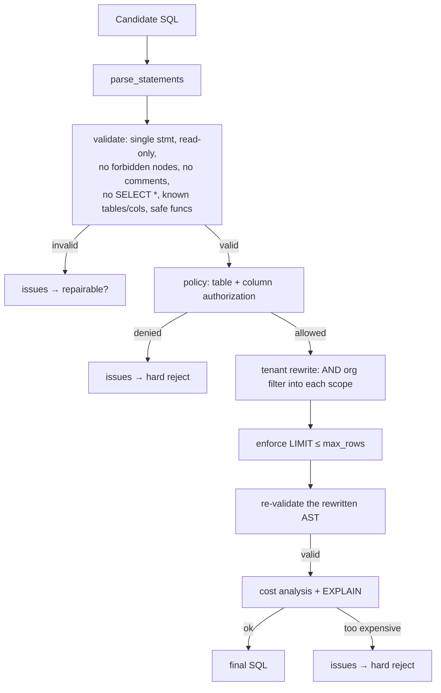

# Component-Level Design

Each stage below lists **what** it does, the **interface** it exposes, and the
**module** that implements it. The orchestrator
([`application/orchestrator.py`](../../src/text_to_sql/application/orchestrator.py))
composes them; route handlers call only the orchestrator.

| Stage | Module | Key type | Responsibility |
| --- | --- | --- | --- |
| Configuration | `configuration/settings.py` | `Settings` | Typed, validated, immutable config from env |
| Errors | `common/errors.py` | `EngineError` tree | Stable codes, HTTP status, retryability, safe details |
| Redaction | `common/redaction.py` | `Redactor` | Scrub secrets/PII from logs, traces, output |
| Schema catalog | `schema/catalog.py` | `SchemaCatalog` | Introspect + enrich + cache the normalized schema |
| Semantic layer | `semantic/*` | `SemanticLayer` | Metrics, terms, classifications, date policy |
| Retrieval | `retrieval/retriever.py` | `LexicalSchemaRetriever` | Select the relevant schema slice |
| Ambiguity | `application/ambiguity.py` | `AmbiguityDetector` | Detect material ambiguity → clarification |
| Dates | `semantic/dates.py` | `resolve_relative_date` | Deterministic relative-date resolution |
| Prompt | `llm/prompt.py` | `PromptBuilder` | Versioned prompt + injection defenses |
| Provider | `llm/base.py` + adapters | `LLMProvider` | Structured SQL generation (fake / OpenAI) |
| Parser | `sql/parser.py` | `parse_statements` | SQLGlot AST + statement classification |
| Validator | `sql/validator.py` | `SQLValidator` | Read-only + schema-reference safety |
| Policy | `security/policy.py` | `PolicyEngine` | Table/column authorization |
| Rewriter | `security/rewriter.py` | `TenantRewriter` | Inject mandatory tenant predicates (AST) |
| Cost | `security/cost.py` | `CostAnalyzer` | Complexity + EXPLAIN-based risk |
| Repair | `application/repair.py` | `RepairPlanner` | Decide repairability, build safe feedback |
| Executor | `execution/executor.py` | `ReadOnlyExecutor` | Bounded read-only execution |
| Explainer | `application/explainer.py` | `ResultExplainer` | Result-grounded natural-language answer |
| Observability | `observability/*` | logging/metrics/tracing | Structured logs, `/metrics`, spans |

## The deterministic gate (`_secure_candidate`)

Every candidate — the first generation *and* every repair — passes through the
exact same sequence in `QueryOrchestrator._secure_candidate`:



The re-validation after rewriting (`V2`) is deliberate defense in depth: even our
own AST mutation is re-checked before it can execute.

## Interfaces and dependency inversion

Two seams are defined as `typing.Protocol`s so implementations can be swapped
without touching the orchestrator:

- **`LLMProvider`** ([`llm/base.py`](../../src/text_to_sql/llm/base.py)) —
  `generate(GenerationRequest) -> GenerationResponse`. Implemented by
  `DeterministicFakeProvider` and `OpenAICompatibleProvider`.
- **`SchemaRetriever`** ([`retrieval/retriever.py`](../../src/text_to_sql/retrieval/retriever.py)) —
  `retrieve(question, schema) -> RetrievalResult`. Implemented by
  `LexicalSchemaRetriever`; an embedding-based ranker can be dropped in later.

The composition root wires everything:

```python
# application/container.py
AppContainer.create(settings)            # production
AppContainer.create(settings, provider=fake, database=..., clock=...)  # tests
```

Because the orchestrator receives every collaborator via its constructor, tests
build it with in-memory doubles and a fixed clock, and exercise the **entire**
security pipeline with **no HTTP server and no real LLM**.
