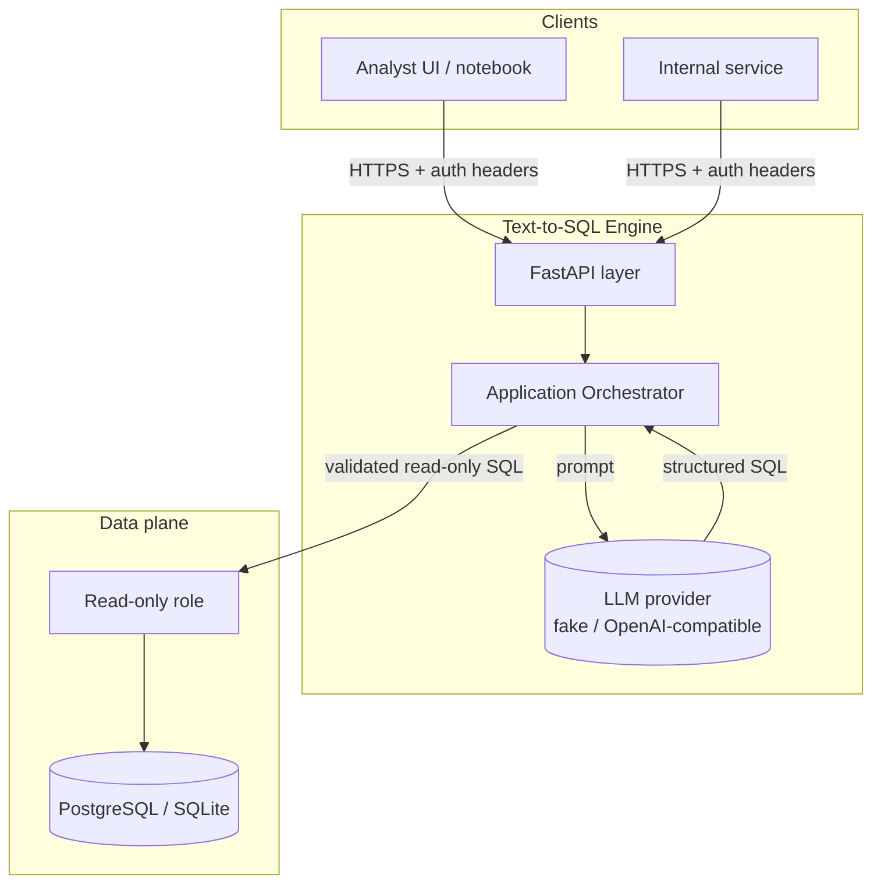
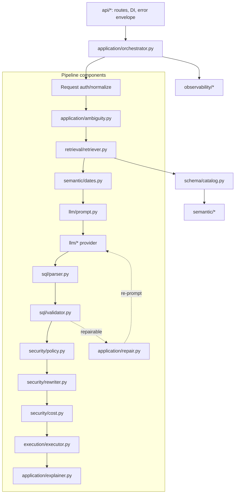
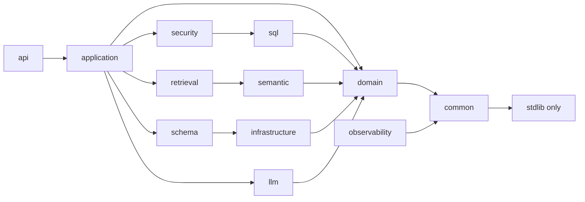
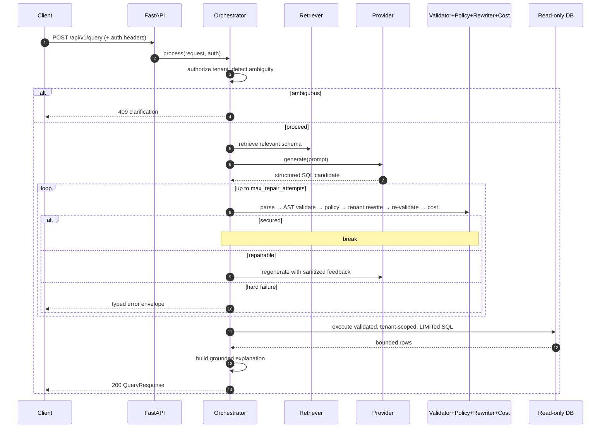
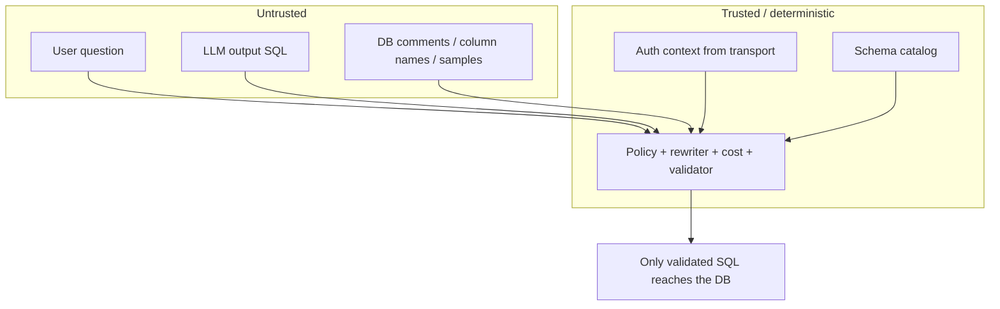

# System Architecture

## System context

The engine is a **stateless** HTTP service. The only stateful dependencies are the
database and (optionally) an LLM provider. Horizontal scaling is a matter of
running more replicas behind a load balancer; there is no server-side session
state (the schema cache is a per-process optimisation, safely rebuilt on demand).

## Component architecture

Layering follows **dependency inversion**: high-level policy (the orchestrator)
depends on abstractions (`LLMProvider` protocol, `SchemaRetriever` protocol),
never on concrete adapters. The composition root
([`application/container.py`](../../src/text_to_sql/application/container.py)) is
the single place where concrete implementations are chosen.

Dependency direction (arrows point to what a layer may import):

`common`, `domain`, and `observability` sit at the bottom and never import upward,
which is what keeps the security core unit-testable **without** a server or a
database.

## Request sequence (execute path)

## Trust boundaries

Everything the model reads or writes is untrusted. The **authenticated context**
(established by the transport/gateway) and the **schema catalog** are trusted. The
deterministic security layer is the gate between them. This is elaborated in the
[threat model](../security/threat_model.md).
