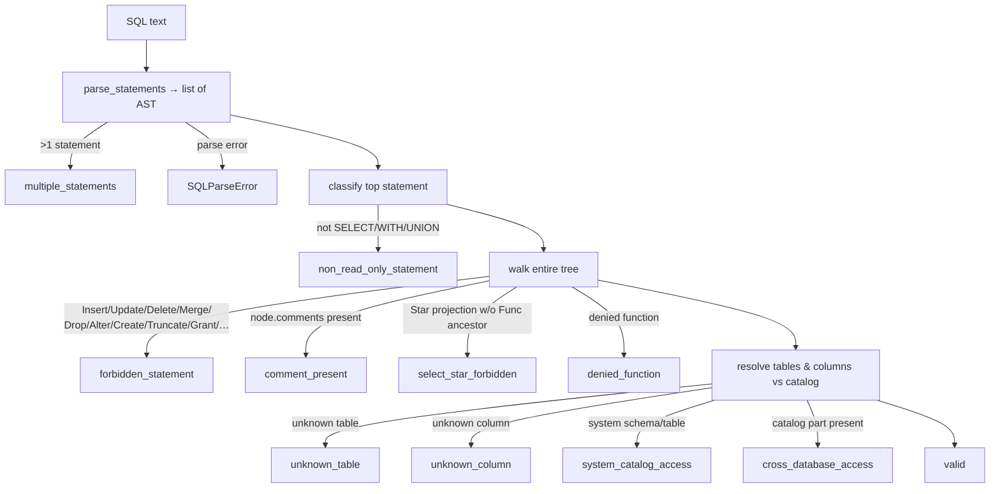

# SQL Parsing & AST Validation

The validator ([`sql/validator.py`](../../src/text_to_sql/sql/validator.py)) is the
first and most important deterministic security gate. This document explains why it
is built on an **abstract syntax tree** rather than string matching, and exactly
what it enforces.

## Lexical vs parser-based vs AST-based validation

| Approach | Example | Why it fails |
| --- | --- | --- |
| **Lexical / regex** | `if "drop" in sql.lower(): reject` | `SELECT "drop" FROM t`, comments, casing, whitespace, unicode all defeat it; false positives on legitimate identifiers. |
| **Parser (accept/reject)** | "does it parse?" | Parsing succeeds for `DROP TABLE users` — parseability is not safety. |
| **AST-based (this project)** | inspect the parsed tree's node types and references | Decisions are made on *structure and meaning*, immune to formatting tricks. |

We use **SQLGlot** to parse SQL into an AST, then reason over nodes. Regex is used
**only** as a redundant backstop for comment smuggling (after stripping string
literals), never as a primary control.

## The validation pipeline

## What is enforced

- **Exactly one statement.** `sqlglot.parse` splits on statement boundaries;
  more than one ⇒ `multiple_statements` (defeats semicolon smuggling).
- **Read-only class only.** Top statement must classify as `SELECT`, CTE-wrapped
  `SELECT`, or `UNION` (`StatementType.is_read_only`).
- **No forbidden node anywhere.** The whole tree is walked for
  `Insert/Update/Delete/Merge/Drop/Alter/Create/Set/Transaction/Command` and (in
  recent SQLGlot) `TruncateTable/Grant/Revoke`. This catches destructive
  statements nested in subqueries or CTEs, not just at the top level.
- **No comments.** Any node carrying comments, plus a regex backstop after
  stripping quoted strings ⇒ `comment_present`. Defeats comment-hidden payloads.
- **No bare `SELECT *`.** A `Star` projection with no function ancestor is
  rejected so the policy engine can reason about concrete columns (`COUNT(*)` is
  fine — the `Star` sits under a `Func`).
- **Function allow/deny.** A denylist of file/exec/sleep/exfiltration functions
  (`pg_sleep`, `pg_read_file`, `load_extension`, `dblink`, …) ⇒ `denied_function`.
- **Schema-reference validity.** Every real table must exist in the catalog; every
  column must exist on a referenced table (alias- and CTE-aware). Yields
  `unknown_table` / `unknown_column`, which the repair loop can fix.
- **No system catalogs / cross-database.** `information_schema`, `pg_*`,
  `sqlite_*`, and three-part (catalog-qualified) names are rejected.

## Alias and CTE handling

Real-world SQL references SELECT-list aliases in `ORDER BY`/`GROUP BY`
(`… AS revenue … ORDER BY revenue`). The validator collects **output aliases** and
does not treat them as unknown columns. CTE and derived-table aliases are treated
as **virtual** sources — columns qualified by them are not checked against the
catalog — but a sensitive base column laundered *through* a CTE is still caught,
because its inner reference (`SELECT users.email FROM users`) is resolved to the
base column.

## Normalization & LIMIT enforcement

[`sql/normalizer.py`](../../src/text_to_sql/sql/normalizer.py) renders the AST back
to canonical SQL and enforces a bounded result set: `enforce_limit` injects a
`LIMIT` where none exists and caps any `LIMIT` above `max_rows`, operating on a
**copy** so the original is untouched until adopted (and then re-validated).
`transpile_sql` converts between dialects (dialect-confusion defense).

## Failure modes & trade-offs

- **Parser gaps.** A construct SQLGlot cannot parse raises `SQLParseError` and is
  rejected — a parse failure is a *safe* failure (it never executes). Some exotic
  but valid SQL may be rejected; that is an acceptable trade-off for safety.
- **`SELECT *` rejection** can annoy users; the fake provider and prompt both
  prefer explicit columns, and the repair loop can fix a stray star.
- **Column resolution is conservative**: ambiguous unqualified columns are
  accepted if they exist on *any* referenced table (we don't attempt full scope
  resolution), which favours availability over strictness.

## Tests

- `tests/unit/test_validator.py` — every rule, positive and negative.
- `tests/unit/test_parser_normalizer.py` — classification, LIMIT logic, transpile.
- `tests/security/test_deterministic_rejection.py` — end-to-end adversarial.
- `tests/property/test_invariants.py` — "destructive statements are never
  accepted" and "unknown tables are never valid" across generated inputs.
