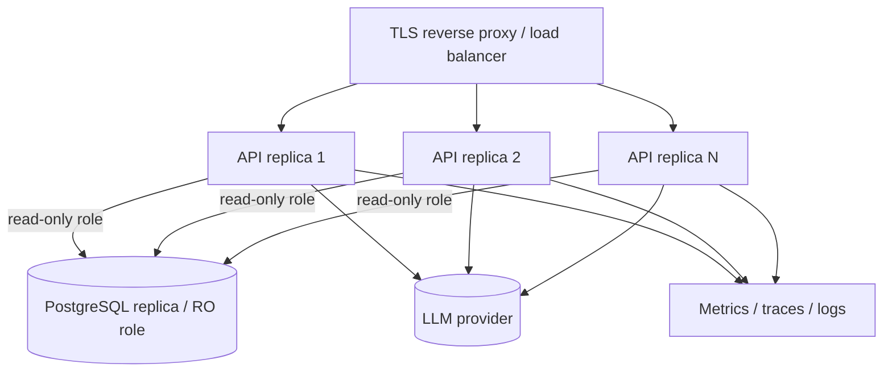

# Production Deployment

## Topology



The API is **stateless**, so scale horizontally by adding replicas behind a load
balancer. There is no shared server state to coordinate.

## Deployment checklist

- [ ] `T2SQL_ENVIRONMENT=production`, `T2SQL_LOG_JSON=true`.
- [ ] `T2SQL_DATABASE_URL` → app role (migrations); `T2SQL_READONLY_DATABASE_URL`
      → a **dedicated read-only role** with `SELECT`-only grants.
- [ ] Secrets (`OPENAI_API_KEY`, DB credentials) injected from a secret manager,
      never in the image or VCS.
- [ ] `T2SQL_STATEMENT_TIMEOUT_MS`, `T2SQL_MAX_ROWS`, and cost thresholds tuned to
      your database's capacity.
- [ ] `alembic upgrade head` run as a pre-deploy migration step.
- [ ] TLS terminated at the proxy; HSTS enabled; the app trusts the proxy's auth
      headers only on the internal network.
- [ ] Readiness gate wired to `/api/v1/health/ready`; liveness to
      `/api/v1/health/live`.
- [ ] `/metrics` scraped by Prometheus; alerts configured (see
      [observability](observability.md)).
- [ ] Audit-log retention configured for the structured logs.

## Migrations

```bash
alembic upgrade head          # forward
alembic downgrade -1          # roll back one revision
```

Migrations derive from the single-source `reference_schema.metadata`, so the
migrated schema and the app's reflected schema cannot drift. Run migrations as a
**separate step** before rolling out new API replicas.

## Reverse proxy & HTTPS

Terminate TLS at a reverse proxy (nginx, Envoy, a cloud LB). The reference build
derives the auth context from `X-User-Id` / `X-Tenant-Id` / `X-Roles`; in
production, an auth gateway should verify a JWT/session and set these headers on
the trusted internal hop (and strip any client-supplied copies). Preserve or set
`X-Correlation-Id` for end-to-end tracing.

## Graceful shutdown

Uvicorn handles `SIGTERM` by draining in-flight requests. The app's shutdown hook
disposes the database engines
([`api/app.py`](../../src/text_to_sql/api/app.py)). Give the platform a
termination grace period ≥ your longest expected request.

## Backup, recovery & rollback

- **Data** is owned by the database; use its native backup/PITR. The engine is
  read-only, so it never needs data restoration for its own sake.
- **Rollback:** deploy the previous image tag; if a migration must be reverted,
  `alembic downgrade` to the prior revision *before* rolling back code that depends
  on the newer schema.
- **Config rollback:** because config is environment-driven and validated at
  startup, reverting an env change and restarting is sufficient.

## Horizontal scaling notes

- The schema cache is per-process; each replica introspects once and caches. After
  a migration, call `POST /api/v1/schema/refresh` (admin) on each replica or rely
  on the TTL.
- The metrics registry is per-process; Prometheus aggregates across replicas.
- LLM provider rate limits are the usual scaling ceiling; the adapter surfaces
  `429` as a retryable `provider_error`.
