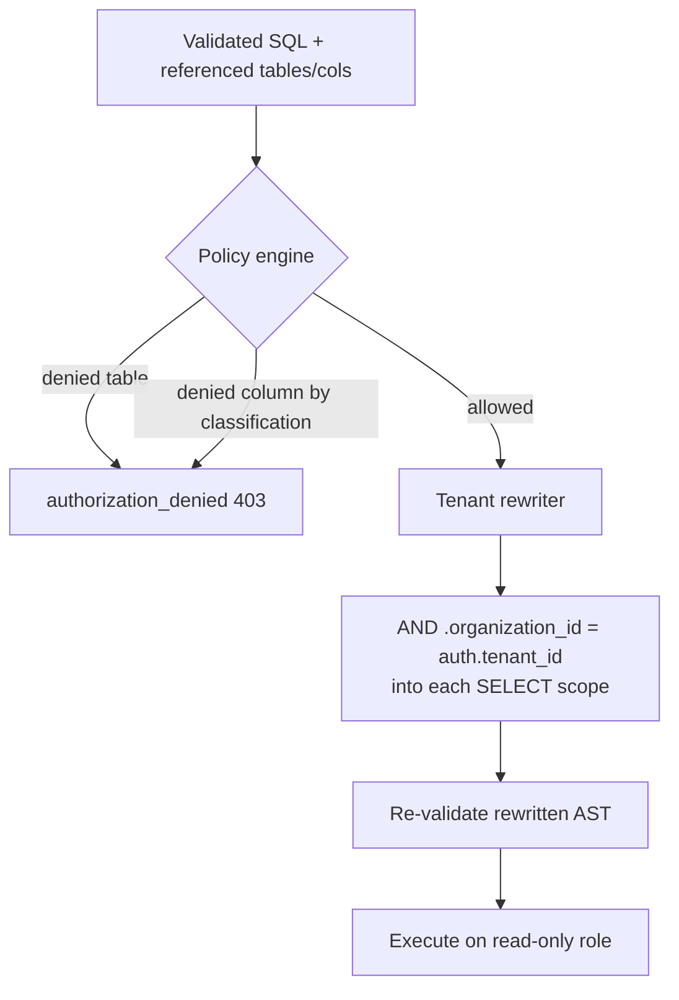

# Authorization & Tenant Isolation

Security must not depend on the LLM. Authorization runs **after** generation, as
deterministic code operating on the parsed AST and the authenticated context.

## Why prompt-level security is insufficient

You can *ask* a model to "only return the caller's tenant" — and it will comply
most of the time. But "most of the time" is not a security guarantee: one
successful prompt injection, one model regression, or one edge case, and a
tenant boundary is crossed. So the engine treats model output as a *proposal* and
enforces authorization independently.

## The authenticated context

`AuthContext` ([`domain/context.py`](../../src/text_to_sql/domain/context.py))
carries `user_id`, `tenant_id`, and `roles`. It is established by the **transport**
— in this reference build from `X-User-Id` / `X-Tenant-Id` / `X-Roles` headers
([`api/dependencies.py`](../../src/text_to_sql/api/dependencies.py)); in production
it would come from a verified JWT / session behind an auth gateway. It is **never**
derived from the request body or the model. If the request body carries a
`tenant_id` that disagrees with the authenticated tenant, the request is rejected.

## Authorization flow



## Table & column authorization

`PolicyEngine` ([`security/policy.py`](../../src/text_to_sql/security/policy.py))
consumes the validator's *resolved* tables and columns and:

- rejects referenced tables in a configured deny-list or outside an allow-list;
- for every referenced column, maps its **classification** to the caller's roles
  via `ColumnAccessPolicy`
  ([`security/classification.py`](../../src/text_to_sql/security/classification.py)).

Default classification rules (reference roles: `admin`, `analyst`, `viewer`):

| Classification | Who may select |
| --- | --- |
| `public`, `internal` | anyone authenticated |
| `confidential` | `analyst`, `admin` |
| `financial` | `analyst`, `admin`, or holder of `finance_read` |
| `pii` | `admin`, or holder of `pii_read` |
| `auth_secret`, `highly_restricted` | **nobody** (via this engine) |

Because the policy runs on *resolved* columns (including those referenced inside
CTEs/subqueries), laundering a sensitive column through a derived table does not
help — the inner reference is already resolved to its base column.

## Tenant isolation via AST rewriting

`TenantRewriter` ([`security/rewriter.py`](../../src/text_to_sql/security/rewriter.py))
walks the parsed query and, for every base table that has a tenant column, ANDs a
predicate into the `WHERE` of the exact SELECT scope that owns that table. Two
properties make it safe:

1. **AST, not strings.** The predicate is built from `sqlglot` expression nodes and
   a typed literal — there is no string concatenation of tenant input into SQL, so
   it cannot be broken out of.
2. **Per-scope.** Scoping is anchored to each table's enclosing SELECT, so
   subqueries, correlated `NOT EXISTS`, and CTEs are each scoped independently. A
   join or subquery cannot smuggle another tenant's rows.

After rewriting, the whole AST is **re-validated** before execution.

### Worked example

Input from the model (note the hostile `organization_id = 2`):

```sql
SELECT SUM(order_items.quantity * order_items.unit_price) AS revenue
FROM order_items JOIN orders ON orders.id = order_items.order_id
WHERE orders.organization_id = 2
```

After rewriting for `auth.tenant_id = 1`:

```sql
SELECT SUM(order_items.quantity * order_items.unit_price) AS revenue
FROM order_items JOIN orders ON orders.id = order_items.order_id
WHERE orders.organization_id = 2
  AND order_items.organization_id = 1
  AND orders.organization_id = 1
LIMIT 1000
```

The contradictory predicate returns **zero rows** — the attack yields nothing.

## Defense in depth: the read-only role

Even a query that passes every check runs through a **read-only** connection
(dedicated PostgreSQL role in production; `PRAGMA query_only` for SQLite) inside a
read-only transaction with a statement timeout. If validation ever had a gap, the
database itself would still refuse a write.

## Tests

`tests/security/test_tenant_isolation.py`, `tests/unit/test_rewriter.py`,
`tests/unit/test_policy_cost.py`, `tests/property/test_invariants.py`.
