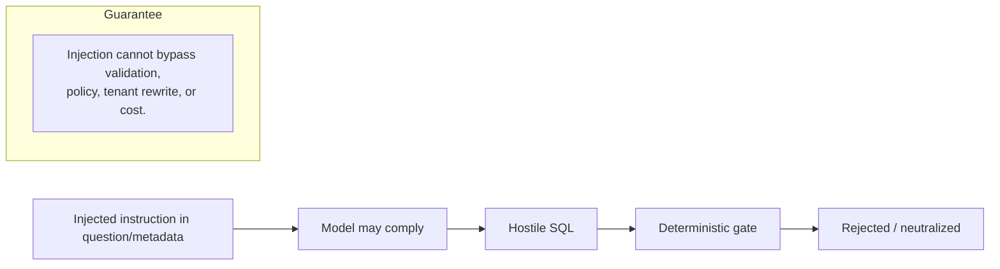

# Prompt-Injection Threat Model

Prompt injection is the risk that untrusted text — the user's question, or
metadata the model reads (comments, column names, glossary entries, sample values)
— manipulates the model into ignoring its instructions.

## The core stance: injection is a *containment* problem, not a boundary

The engine does **not** rely on the prompt to enforce security. Everything the
model produces is re-validated deterministically (parse → AST validate → policy →
tenant rewrite → cost). Therefore a *successful* prompt injection can, at worst,
make the model emit hostile SQL — which is then **rejected**. This is proven by
`tests/security/test_injection_and_leakage.py::test_injection_via_scripted_drop_still_rejected`,
where the model is *fully* manipulated (scripted to emit `DROP TABLE`) and the
request is still rejected.

## Defense-in-depth measures (probabilistic, still worthwhile)

1. **Structured, fenced prompt.** `PromptBuilder`
   ([`llm/prompt.py`](../../src/text_to_sql/llm/prompt.py)) separates system
   instructions, schema, semantics, and the user question into labelled sections,
   and explicitly tells the model to treat the question/metadata as **data**.
2. **Sanitization of untrusted text.** `sanitize_untrusted` strips control
   characters, neutralizes leading role markers (`system:` → look-alike),
   escapes code fences, and collapses the question to a single line so it cannot
   fabricate multi-section structure.
3. **Flattened metadata.** `DatabaseSchema.serialize_for_prompt` collapses
   database comments to a single length-bounded line, so a multi-line "comment"
   cannot masquerade as a real prompt section
   (`test_malicious_table_comment_is_flattened_in_prompt`).
4. **Detection & telemetry.** `contains_injection_markers` flags known injection
   phrasing; the orchestrator increments `t2sql_injection_markers_total` and logs a
   warning for monitoring — it does **not** block on it (blocking on a keyword is
   itself brittle).

## Indirect injection (via metadata)

Because table/column comments, names, and sample values come from the database,
they are **untrusted**. They are sanitized (see above) and — crucially — the
model's output is validated regardless. A poisoned comment cannot cause a data
breach.

## Residual risk

- A cleverly injected prompt could still cause a **valid but semantically wrong**
  query (a correctness problem, not a security one) — surfaced via
  confidence/assumptions and measured by the golden suite.
- Prompt hardening is *probabilistic*; we never count it as a control. The
  deterministic gate is the control.

## Tests

`tests/security/test_injection_and_leakage.py`,
`tests/unit/test_semantic_prompt.py` (sanitization),
`tests/unit/test_schema_models_catalog.py` (comment flattening).
