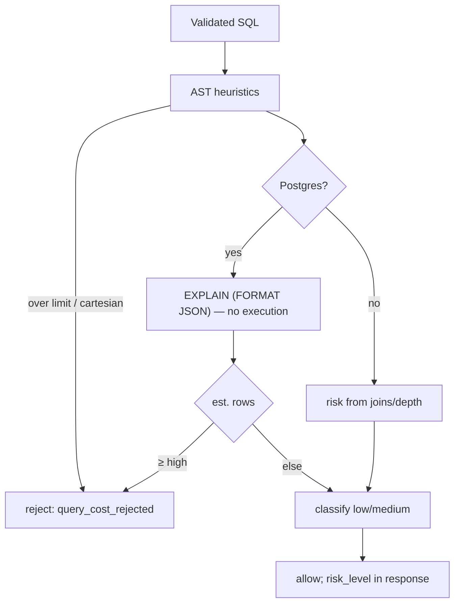

# Query-Cost & Complexity Controls

Expensive queries are a denial-of-service vector against the shared database. The
`CostAnalyzer` ([`security/cost.py`](../../src/text_to_sql/security/cost.py))
applies two layers of control.

## Layer 1 — AST heuristics (always available, dialect-independent)

Computed directly from the parsed tree, before any DB round-trip:

| Metric | Limit (default) | Setting |
| --- | --- | --- |
| Join count | 6 | `T2SQL_MAX_JOINS` |
| Subquery nesting depth | 4 | `T2SQL_MAX_SUBQUERY_DEPTH` |
| Projected columns | 60 | `T2SQL_MAX_SELECTED_COLUMNS` |
| Cross join / Cartesian product | rejected | — |

Exceeding any limit is a **hard rejection** (`query_cost_rejected`). Cartesian
detection flags explicit `CROSS JOIN` and any join lacking `ON`/`USING` (implicit
comma joins), excluding natural joins.

## Layer 2 — planner estimate (PostgreSQL, safe)

When running on PostgreSQL, the analyzer runs `EXPLAIN (FORMAT JSON) <sql>` — **not
`EXPLAIN ANALYZE`**, so the query is *not executed* — and reads the estimated
`Plan Rows` and `Total Cost`. Estimated rows classify risk and can reject:

| Estimated rows | Risk | Action |
| --- | --- | --- |
| `< cost_rows_medium_threshold` (100k) | low | allow |
| `≥ medium`, `< high` | medium | allow (flagged) |
| `≥ cost_rows_high_threshold` (1M) | high | **reject** (`estimated_cost_too_high`) |

## Runtime bounds (independent of the estimate)

- **`LIMIT`** is always injected/capped (`enforce_limit`) → the result set is
  bounded regardless of the plan.
- **Statement timeout** (`SET LOCAL statement_timeout`, PostgreSQL) → a query that
  runs too long is cancelled by the database.
- **Row-cap fetch** — the executor fetches at most `max_rows + 1` and reports
  truncation, so even an under-estimated query cannot stream unbounded rows into
  the app.

## Limitations of planner-based estimation (documented)

- Planner estimates are **approximate**; skewed data or stale statistics can make
  them wrong in either direction. They are one signal, not the sole control — the
  `LIMIT` and timeout are the hard runtime bounds.
- **SQLite** exposes no comparable row/cost estimate, so there we rely on the AST
  heuristics plus `LIMIT` and the row-cap. This is called out in the module
  docstring and here.
- `EXPLAIN` can itself fail to plan some constructs; the analyzer logs and skips
  the estimate rather than failing the request (the AST heuristics still apply).

## Tests

`tests/unit/test_policy_cost.py` (cartesian, joins, depth, risk),
`tests/unit/test_executor_cost_internals.py` (metric helpers),
`tests/security/test_deterministic_rejection.py::test_cartesian_product_rejected`.
