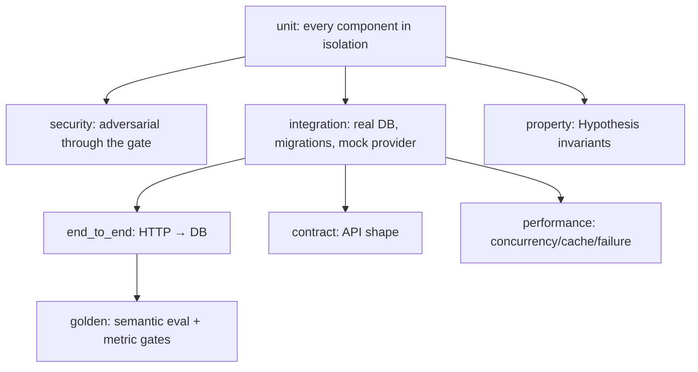

# Testing Strategy & Evaluation Methodology

The suite is deterministic (fixed clock `2026-07-24`, deterministic seed data,
fake LLM provider) and organised by level. Run everything with `make test`
(90% coverage gate) or a level with `pytest -m <marker>`.

## The test pyramid

| Level | Marker | What it proves | Location |
| --- | --- | --- | --- |
| Unit | `unit` | each component's logic in isolation | `tests/unit/` |
| Integration | `integration` | real DB behaviour, migrations, provider adapter vs mock server | `tests/integration/` |
| End-to-end | `e2e` | full HTTP→DB, verifying SQL/policy/results/metadata/explanation | `tests/end_to_end/` |
| Security | `security` | deterministic rejection of hostile SQL at our layers | `tests/security/` |
| Property | `property` | invariants across generated inputs (Hypothesis) | `tests/property/` |
| Contract | `contract` | stable API surface + error-envelope shape | `tests/contract/` |
| Performance | `performance` | concurrency, cache speed, graceful provider failure | `tests/performance/` |
| Golden | `golden` | semantic correctness + safety metrics | `tests/golden/` |

## What makes the security tests meaningful

Security tests **force** the (fake) model to emit hostile SQL via scripting and
then assert the *deterministic pipeline* rejects it — never "the LLM refused". For
example, `test_injection_via_scripted_drop_still_rejected` scripts a `DROP TABLE`
and asserts a hard rejection. Property tests assert invariants like *"destructive
statements are never accepted"* and *"tenant scoping can never be removed"* across
many generated identifiers/whitespace/casing variations.

## Mocking policy

Mocking is used **only at external boundaries**: the OpenAI adapter is tested
against an `httpx.MockTransport` fake server; the LLM is the deterministic fake in
every other test. Integration/e2e tests exercise **real** application logic and a
**real** database engine (SQLite locally, PostgreSQL in CI).

## Coverage quality gates

- Overall line+branch coverage ≥ **90%** (`--cov-fail-under=90`, enforced in CI).
- Critical modules (`sql/validator.py`, `security/*`) are covered by dedicated unit
  + security + property tests; coverage percentage is a floor, not the goal —
  branch coverage and meaningful assertions matter more.
- Lint (`ruff`), types (`mypy`), and security scan (`bandit`) must pass.
- Migration up/down and an app-startup smoke test run in CI.

## Evaluation methodology (golden suite)

Evaluation is **separate** from ordinary tests
([`tests/golden/`](../../tests/golden)). Each `GoldenCase` states *semantic*
expectations, not an exact SQL string, because many queries are equivalent. Checks
assert on:

- parsed **AST properties** (no `SELECT *`, referenced tables),
- **schema linking** (expected tables ⊆ referenced tables),
- **execution result** shape (row-count bounds),
- **clarification** behaviour,
- **deterministic rejection** for security cases.

### Metrics reported (distinct levels of "correct")

The harness (`python -m tests.golden.run_eval` → `eval_results/`) reports:

| Metric | Meaning |
| --- | --- |
| `valid_sql_rate` | syntactic + schema validity of success cases |
| `execution_accuracy` | cases that executed and met result expectations |
| `schema_linking_recall` | required tables actually referenced |
| `clarification_accuracy` | ambiguous cases correctly clarified |
| `unsafe_query_rejection_rate` | security cases deterministically rejected |
| `avg_latency_ms` | mean per-case latency |

The deterministic fake baseline achieves 1.0 on validity/safety/clarification —
**this measures the pipeline, not model IQ**. Pointing the harness at a real
provider (`.github/workflows/live-eval.yml`) measures a specific model/prompt
version against the same dataset. We deliberately **distinguish** syntactic
validity, schema validity, execution success, semantic correctness, result
correctness, and security compliance — a system is not "accurate" just because its
SQL parses.

## Load testing

`tests/performance/locustfile.py` drives the running API (fake provider, no cost).
Run `locust -f tests/performance/locustfile.py --host http://localhost:8000` and
watch p50/p95 latency and error rate; expect low latency since generation is
deterministic and local. In production, latency is dominated by the real provider.
